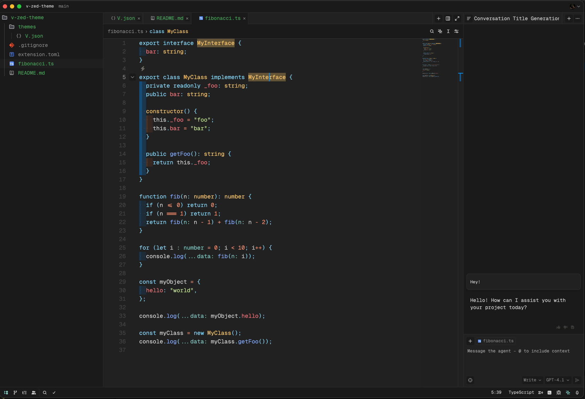

# V Theme
Simple dark & high contrast theme for [Zed](https://zed.dev/)

## Installation

### Manual
1. Download the theme file from the [JSON file](https://github.com/necm1/v-zed-theme/blob/main/themes/V.json).
2. Extract the contents of the downloaded file.
3. Copy the `v-zed-theme` folder to your Zed themes directory (`~/.zed/themes` on Linux/macOS, `%APPDATA%\zed\themes` on Windows).
4. Restart Zed to apply the theme.

## Preview

